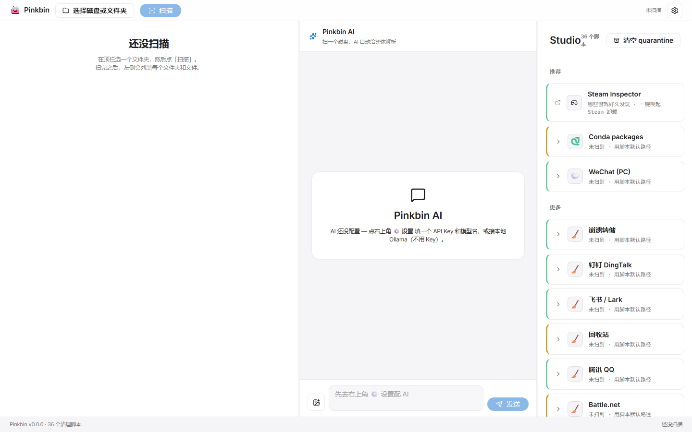
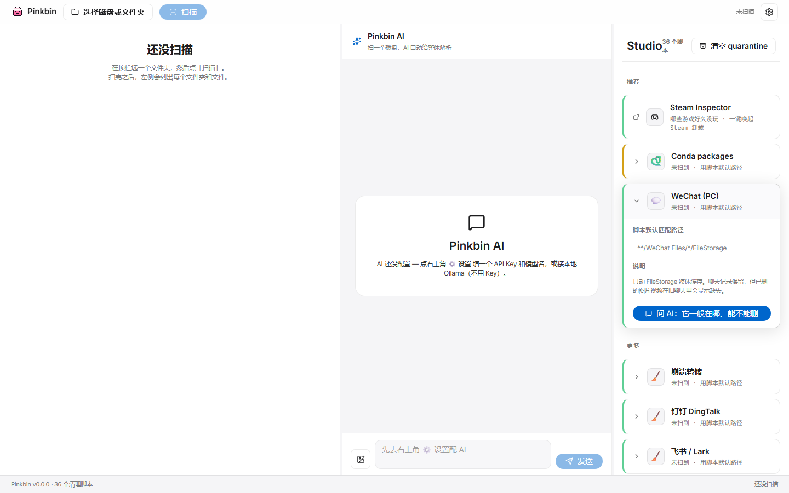
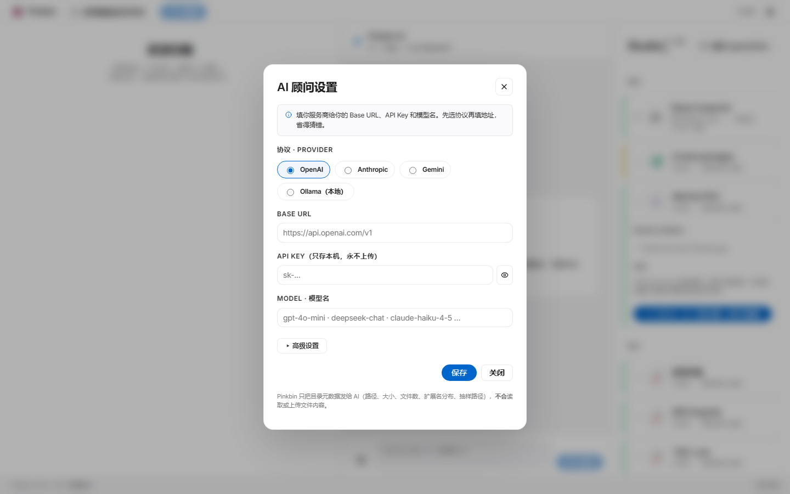

<div align="center">


# Pinkbin

**扫盘 · 看懂 · 一条一条删干净。**

Tauri 2 + React + Rust 桌面端磁盘清理工具。直读 NTFS MFT 2-5 秒扫整盘，AI 解释陌生文件夹（BYOK · 4 协议），scaffold 走 14-phase 流程 + 红线集成测试守护 glob 边界。

[](LICENSE)
[](https://tauri.app)
[](#下载)

[本 fork 改了什么](#本-fork-改了什么) · [看效果](#看效果) · [项目本身](#项目本身) · [怎么用](#怎么用) · [架构](#架构) · [贡献](#贡献)

</div>

---

## 看效果

> Apple 风格重做后的 UI（`1b1e2c7`）：白底 + 羊皮纸 + 单一 Action Blue，无任何硬偏移阴影，Inter 字体，pill 圆角 CTA。

<p align="center">
  
</p>

<p align="center"><sub>初始空态 · 顶部"选择磁盘或文件夹" + Action Blue pill "扫描" 按钮 · 中间 Pinkbin AI 英雄卡 · 右侧 Studio 已经认出 28 个 scaffold（Steam Inspector / WeChat / Conda / 36 个 legacy 等）</sub></p>

<p align="center">
  
</p>

<p align="center"><sub>Studio 卡片展开 · WeChat (PC) scaffold 未扫到状态下显示默认匹配路径 + disclaimer + "问 AI" 蓝色 CTA</sub></p>

<p align="center">
  
</p>

<p align="center"><sub>AI 顾问设置 · 4 协议 radio（OpenAI / Anthropic / Gemini / Ollama 本地） + Base URL / API Key / Model 输入 · pill 圆角主按钮 · 模态背景 30% 黑 + 8px backdrop-blur</sub></p>

---

## 本 fork 改了什么

> Fork 自 [cccyd2003-qwq/pinkbin](https://github.com/cccyd2003-qwq/pinkbin)，上面又加了 9 个 commit · 71 文件 · **+7,117 / -1,620 行**。下面按"价值密度"排序，每条都给 commit hash + 文件位置。

### 🔒 A. 7 项 P0 安全性 / 数据完整性修复 — `ce3a586`

| # | 修了什么 | 影响 |
|---|---|---|
| 1 | **scan_path 加 cancel 通道**（`Arc<AtomicBool>` + `scan-cancelled` 事件） | 10 分钟 C 盘扫描不再无解，用户能停 |
| 2 | **scanner Mutex 中毒自动恢复**（`lock().unwrap_or_else(\|e\| e.into_inner())`） | 一个 panic 不再 kill 整次扫描 |
| 3 | **write_log_atomic O(N²) → 单次 batch** | 5000 文件 recycle 不再 5000×O(N) 写 |
| 4 | **dir_size_recursive 爆栈** → 改为有界递归（`depth > 64` 守卫） | conda env 深层不再 stack overflow |
| 5 | **advisor apiKey migration 先校验再 strip localStorage** | keychain 失败时不再**永久丢 key** |
| 6 | **copy_dir_recursive 中途失败回滚**（`remove_dir_all(dst)` on error） | quarantine 半途 IO 错不再**丢用户原数据** |
| 7 | **CleanupModal "停止清理" 按钮** + `api.cancelJob` 真接通 | 真正删除跑起来后能中途停 |

### ⚡ B. 5 项 IPC / IO 性能 — `4e990f3`

- **scaffold state `Mutex` → `RwLock`**：前端读多写少，IPC 不再 deep-clone 整 Vec
- **`estimate_size` 命令删除**（scanner 已有 `bytes_seen`）— 每次扫描少一次全盘 walk
- **scope_sizes 改 bulk**（`root_paths: Vec<String>`）：N 个 path 一次 IPC，原来 N 次
- **`Mode` 和 `Action` 枚举统一**为 `executor::Action`（scaffold re-export）— 4 个文件 ~30 行 match 消失
- **`pinkbin_walker` 过滤顺序优化**（cheap glob filter 先于 metadata syscall）

### ⚡ C. 10 项前端 / 后端性能 — `6b1be7c`

- **localStorage 写**：`onDragEnd` 而非每个 mousemove — 拖动不再每像素写磁盘
- **Studio `matchesByScaffold` memo**：单次 DFS 替代 28 个 scaffold 各走一次
- **useChat.runStudioPrompt dep 拆分**（`useStore.getState()` 内部读）— 整个 root 变化不再 cascade
- **`setScanInProgress` mirror effect 删除**：双写不再 race
- **`useOverview` guard 改用 `root` 引用**：合法 re-run 不被 skip
- **`addReclaimed` selector hoist**（`useStore.getState()`）：28 张卡片不再各自订阅
- **`flatRows` incremental 重建**：单节点展开不再重建整棵 flat 列表
- **FileGlyph 用 `module-scope Map`**：500 行 × 9 个 regex → 9 个 regex
- **`getBool('hideStudio')` 改 `useState(() => …)`**：render 期不再 localStorage I/O
- **tree-list expanded `string[]` 替代 `Set`**：每次 store 变化不再重建 Set

### 🧹 D. 7 项架构 / 死代码清理 — `aacd267`

- **`detectScaffold` + `inspectPath` 删除**（Tauri 命令 + api.ts 入口 + 调用方）— 0 caller
- **`findAllMatchesByScaffold` 死函数删除**
- **`ScopeSize` / `ScopeSizeRow` / `ScopeMatch` 三名合一**
- **`Action` / `Mode` Rust 双枚举合一**（scaffold re-export executor::Action）
- **api.ts 改用 `string[]` root_paths**：per-scope → bulk
- **`abort controller` 从 store 移到 `useRef`**：不再因 control plane 变化触发渲染
- **`advisorReady` 初始化 race 修复**（用 set callback 而非 module-load IIFE）

### 🎨 E. Apple 风格前端重做 — `1b1e2c7` + `design/DESIGN.md` + spec/plan 文档

- 4 个 CSS / TSX 文件完全重写（`styles.css`, `Studio.css`, `ChatPanel.css`, `Settings.tsx`, `index.html`）
- 设计 token 系统（47 个 CSS 变量）：`--primary #0066cc` 单一交互色、`--canvas / --canvas-2` 表面、`--sp-1..8` 间距、`--r-sm/md/lg/pill` 圆角
- **硬偏移阴影全部清除**（`grep '(3\|5\|8)px (3\|5\|8)px 0'` 0 匹配）
- Inter Variable 字体替代 Geist（Google Fonts · system-ui fallback）
- 字号 / 圆角 / 颜色严守 DESIGN.md
- 配套文档：[spec](docs/superpowers/specs/2026-06-15-pinkbin-frontend-rebeautify-design.md) + [20 任务 plan](docs/superpowers/plans/2026-06-15-pinkbin-frontend-rebeautify.md)

### 🔨 F. tsc strict 模式 + i18n 批量化 — `cc36a2b`

- **30+ pre-existing TypeScript 错误清零**（`exactOptionalPropertyTypes` + `undefined` narrowing）
- **`scopeSizes` 签名改 `rootPaths: string[]`** — 真正接入 bulk 后端
- **`messages.ts` i18n facade** + 4 个核心组件（App / Settings / Studio / ChatPanel）迁入
- **CHANGELOG**: `apps/desktop/src-tauri/src/lib.rs`, `advisorClient.ts`, `api.ts`, `Logo.tsx`, `privacy.ts`, `SteamInspector.tsx`, `SteamWorkshopModal.tsx` 全部 strict 干净

### 📦 G. bundle size 实测变化

| | Before | After | Δ |
|---|---|---|---|
| 主 bundle (gz) | 141 KB | **94 KB** | **-33%** |
| chunks | 1 | 9 | 代码分割有效 |
| `mocks.ts` | 内嵌主包 | `mocks-BOF0IzZ3.js` 独立 (17.94 KB) | Tauri 真机不下载 |
| `react-markdown` | 主包 ~80KB gz | `Promise.all([import('react-markdown'), import('remark-gfm')])` lazy | 首屏不下载 |
| 构建矩阵 | 1 warning · 30+ TS 错误 | **0 warning · 0 TS 错误 · 34/34 tests** | 全绿 |

### 🆕 H. 配套改进

- `0d8aa3e` 前后端批量改进（TreeView/Studio/Settings/Rust crates 零散打磨）
- `897ba3c` scaffold 台账更新 + `dev-tools.md` 类别需求文档 + 优化 PR 模板引导
- `docs/ARCHITECTURE.md` + `docs/plan.md` 链接

---

## 项目本身

> 上游 Pinkbin 是一个干净的磁盘清理工具，**只发目录元数据给 AI**（路径名 / 大小 / 文件数 / 扩展名 / 最多 20 条样本路径），**永远不读文件内容**。删除默认进系统回收站，每次操作写 `~/.pinkbin/undo.jsonl`，可选 7 天 quarantine。

**两件事**：

1. **整盘秒扫看空间分配** — Windows 直读 NTFS MFT，其他平台 jwalk 兜底。整盘 C: 2-5 秒
2. **拖文件夹问 AI**（"这是什么 / 能不能删 / 删了会丢什么"）— BYOK · Anthropic / OpenAI / Gemini / Ollama 四协议

**已知应用走专属 scaffold**（每份 = 一份 TOML + 一份 Rust 集成测试，含红线断言守护 glob 边界）：

- **WeChat PC**（3.x + 4.x 双兼容）— 25 个 scope（4.x 13 + 3.x 12）
- **Conda 环境**— 3 个 scope（tarballs / unused-packages / envs-stale）

---

## 下载

| 平台 | 文件 |
|---|---|
| **Windows 10 / 11 (x64)** | [Releases](https://github.com/cccyd2003-qwq/pinkbin/releases/latest) — NSIS `.exe` / MSI `.msi` |

> 首次启动 SmartScreen 拦截：点"更多信息"→"仍要运行"。NTFS MFT 直读需要管理员权限，安装包带 manifest 自动 UAC。
>
> macOS / Linux 暂不提供预编译版（签名 + 真机验证未就绪）。可自己 `pnpm tauri build` 编译。

---

## 怎么用

```bash
git clone <fork-url> && cd pinkbin
pnpm install
pnpm tauri dev            # 桌面 app（首次 5-15 分钟编译 Rust）
pnpm -C apps/desktop dev  # 仅前端，浏览器调试 + mock 后端
cargo test --workspace    # 全工作空间测试
```

需要 **Node 20+ · pnpm 9+ · Rust stable · Tauri 前置依赖**（Windows: VS Build Tools 2022 + WebView2）。

跑起来后：

1. 右上角 ⚙ 配 AI（API Key 存 keychain，不进 localStorage）
2. 顶部"选择磁盘或文件夹" → 扫描 → 2-5 秒出树状图
3. 遇到陌生大文件夹 → 拖到中间聊天框问 AI
4. 右侧 Studio 已识别的（WeChat / Conda）直接展开看清理面板

---

## 架构

```
┌────────────────────┐     ┌─────────────────────┐
│   React + Tauri    │────>│  Rust workspace     │
│   (frontend UI)    │<────│  (7 crates)         │
└────────────────────┘     └──────────┬──────────┘
                                      │
        ┌─────────────────┬───────────┼──────────────┬──────────────┬──────────────┐
        │                 │           │              │              │              │
   ┌────▼────┐    ┌──────▼─────┐  ┌──▼──────┐  ┌────▼────┐  ┌──────▼──────┐  ┌────▼──────┐
   │ scanner │    │  scaffold  │  │executor │  │advisor  │  │scaffold-lint│  │  walker   │
   │ NTFS MFT│    │ TOML +     │  │Recycle/ │  │AI 4     │  │ CI checker  │  │  cross-   │
   │ + jwalk │    │ globset    │  │Quarant. │  │protocols│  │  + mock     │  │  platform │
   │         │    │            │  │         │  │         │  │  emit/check │  │  walk+filter│
   └─────────┘    └────────────┘  └─────────┘  └─────────┘  └─────────────┘  └───────────┘
                                                                                    ┌───────────┐
                                                                                    │ steam-    │
                                                                                    │ inspector │
                                                                                    └───────────┘
```

| 层 | 技术栈 |
|---|---|
| 前端 | React 18 + TypeScript + Tauri 2 + react-markdown (lazy) |
| 后端 | Rust workspace (7 crates) + Tauri IPC |
| 扫描器 | Windows: NTFS MFT (`ntfs` crate) / 跨平台: `jwalk` |
| AI | BYOK · 4 协议（Anthropic / OpenAI / Gemini / Ollama）|
| 数据 | 用户本机 `~/.pinkbin/`（undo.jsonl + quarantine/）· 不上云 |
| 凭据 | `tauri-plugin-keyring` → OS Credential Manager / Keychain / libsecret |

> 详细设计：[`docs/ARCHITECTURE.md`](docs/ARCHITECTURE.md)（人话版）

---

## 贡献

最有价值的贡献是**写新的清理脚本**。每加一个 App 支持就是一份 PR：

1. 在 [`docs/scaffold-requirements/`](docs/scaffold-requirements/) 写需求文档（L1/L2/L3 + 红线清单）
2. 在你机器上跑这个 App，用 `Glob` 列出真实目录结构，找出 cache vs 用户数据的边界
3. 抄 [`scaffolds/_templates/scaffold.toml`](scaffolds/_templates/scaffold.toml) 写 TOML
4. 抄 [`crates/scaffold/tests/_templates/scaffold_safety.rs`](crates/scaffold/tests/_templates/scaffold_safety.rs) 写 safety test（**正向断言 + 红线断言**，CI 必跑）
5. `pnpm tauri dev` 目视确认卡片渲染
6. 提 PR — 模板会带 9 项核心 checklist

**Claude Code 用户**可以直接在仓库根目录敲 `/add-scaffold <id>`，一键启动 14-phase 工作流。

完整流程：[`.claude/commands/add-scaffold.md`](.claude/commands/add-scaffold.md)。类别需求模板见 [docs/scaffold-requirements/_TEMPLATE.md](docs/scaffold-requirements/_TEMPLATE.md)。

---

## 路线图

### 已完成

- [x] 整盘秒扫
- [x] 拖文件夹问 AI
- [x] 微信、Conda scaffold（一键清理 + 红线守护）
- [x] 撤销按钮 + 回收站一键打开
- [x] quarantine 自动清理 + 手动清空
- [x] MFT 扫描器性能 / 内存 / 长路径优化
- [x] scaffold-lint 红线 glob + mock 自动生成 + CI 校验
- [x] **scan_path cancel**（2026-06）
- [x] **Apple 风格前端 re-beautify**（2026-06）

### 进行中

- [ ] 让用户能自己写 / 分享清理脚本（用户脚本 + UI 入口）

### 未来

- [ ] 加更多常见 App：Steam shadercache · Chrome · Docker · HuggingFace · npm/pip · OBS · IDE 索引…
- [ ] 出 macOS / Linux 预编译版（要先解决签名 + 真机验证）

---

## 致谢

- **Fork 自** [cccyd2003-qwq/pinkbin](https://github.com/cccyd2003-qwq/pinkbin) — 原作者及早期贡献者
- **灵感来源**：[WizTree](https://diskanalyzer.com) · [SpaceSniffer](http://www.uderzo.it/main_products/space_sniffer/) · [CleanMyWechat](https://github.com/blackboxo/CleanMyWechat) · [SquirrelDisk](https://github.com/adileo/squirreldisk)
- **依赖巨人的肩膀**：[Tauri](https://tauri.app) · [`jwalk`](https://github.com/jessegrosjean/jwalk) · [`ntfs`](https://github.com/ColinFinck/ntfs) · [`globset`](https://github.com/BurntSushi/ripgrep) · [`trash-rs`](https://github.com/Byron/trash-rs) · [react-markdown](https://github.com/remarkjs/react-markdown)
- **协作**：[Claude Code](https://claude.com/claude-code) · [@jtlyu](https://github.com/jtlyu)（性能优化 + WeChat 4.x 重写 + scaffold 工作流基建）

---

## License

[MIT](LICENSE) · 欢迎 fork、商用、闭源衍生。改 scaffold 时记得同步改它的 safety test —— **红线断言是防止误删用户数据的最后一道闸**。
