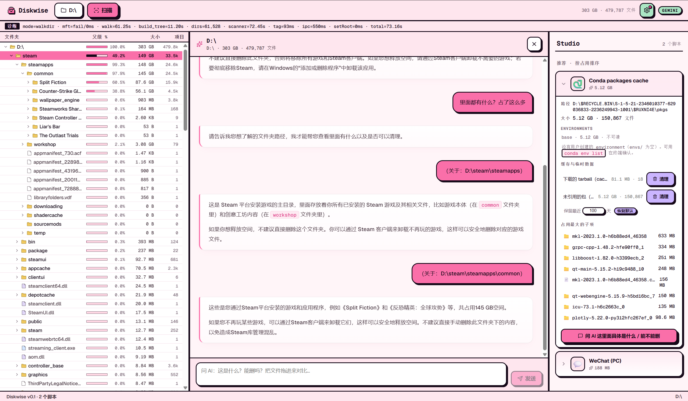
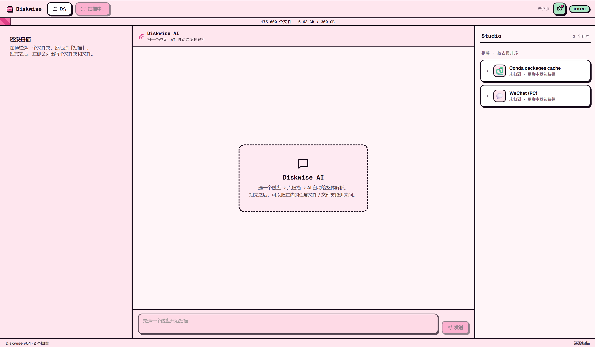

<div align="center">


# Pinkbin

**扫盘 · 看懂 · 一条一条删干净。**

开源磁盘清理工具。秒扫整盘看空间分配，把不认识的文件夹拖给 AI 让它告诉你这是什么、能不能删、删了会丢什么，再按 scope 逐项放心删——默认进回收站，永远不读你的文件内容。

[](LICENSE)
[](https://tauri.app)
[](#下载)

[下载](#下载) · [看效果](#看效果) · [三件事](#三件事) · [怎么用](#怎么用) · [架构](#架构) · [路线图](#路线图) · [帮帮孩子吧](#怎么贡献) · [致谢](#致谢)

**简体中文 | [English](README_EN.md)**

</div>

---

## 下载

<p align="center">
  <a href="https://github.com/cccyd2003-qwq/pinkbin/releases/latest"></a>
</p>

| 平台 | 文件 | 备注 |
|---|---|---|
| **Windows 10 / 11 (x64)** | [`Pinkbin_x.x.x_x64-setup.exe`](https://github.com/cccyd2003-qwq/pinkbin/releases/latest)（NSIS）<br>[`Pinkbin_x.x.x_x64_en-US.msi`](https://github.com/cccyd2003-qwq/pinkbin/releases/latest)（MSI） | 首次启动 SmartScreen 拦截：点"更多信息"→"仍要运行"。NTFS MFT 直读需要管理员权限，安装包带 manifest 自动 UAC |

> macOS / Linux 暂不提供预编译版（macOS 还没有签名证书，Linux 也没在真实机器上验过）。你可以自己 `pnpm tauri build` 编译。等有签名通道 + 真机验证后会把 release 矩阵加回来——欢迎 PR。

---

## 看效果

<p align="center">
  
</p>

<p align="center"><sub>实际使用 · 左：D:\ 树状视图（每行带占用百分比条）· 中：拖 <code>D:\steam\steamapps</code> 给 AI，AI 用 markdown 回答这是什么、能不能删 · 右：Studio 卡片展开 Conda packages cache（5.12 GB · 150,867 文件）</sub></p>

<p align="center">
  
</p>

<p align="center"><sub>初始空态 · 顶部"选择磁盘或文件夹"→ 点扫描后才会有内容；右侧 Studio 已经认出 WeChat / Conda 两个脚本（脚本默认路径还没扫到，所以是"未扫到"状态）</sub></p>

---

## 三件事

Pinkbin 只做三件事：简单、简单、还是TMD简单

### 1. 把磁盘空间分配看清楚

Windows 上直读 NTFS Master File Table（其他平台用 jwalk 跨平台 walker 兜底），整盘 C: **2–5 秒**扫完。出彩色 treemap + 单行 22px 高的树视图——一眼看到 `D:\xwechat_files` 占了 80GB，`C:\Users\<你>\AppData\Local\Docker` 占了 50GB。

### 2. 拖拽到中间 AI 分析"这个文件夹是什么"

不认识的文件夹？把它从左边树或右边路径**拖进中间聊天框**，AI 解释这是什么、能不能删、删了会丢什么。BYOK——你提供 Anthropic / OpenAI / Gemini 的 Key，或本地跑 Ollama 完全免费。

**Pinkbin 只发目录元数据**给 AI（路径名、大小、文件数、扩展名占比、最多 20 条样本路径）—— **永远不读文件内容**。

### 3. 已知应用走专属清理脚本

某些应用大众化、占空间大、清理边界清楚——给它写一份**清理脚本**（一份 TOML + 一份 Rust 集成测试），用户在 Studio 卡片里直接按 scope 单独清。**目前两个**：

- **微信 PC 端**（3.x + 4.x 双兼容）—— 22 个 scope，清缓存/接收媒体/聊天备份，永不动聊天 DB / 收藏 / 朋友圈 / `CustomEmotion`
- **Conda 环境**—— 整目录回收 stale env（`conda-meta/history` mtime > 90 天），base env 灰显不可勾

**未来会做的**：Steam shadercache · Chrome 缓存 · Docker buildx · HuggingFace 模型 · npm/pnpm/pip cache · OBS 录像 · IDE 索引——大众应用、占空间大、清理边界清楚的，逐个走 14-phase 工作流加进来（含红线集成测试守护）。**为什么砍掉之前那 36 个 legacy scaffold**：因为没人验过 glob 边界，存在误删风险（典型例子：旧版 `node-modules` 把 Cursor / VSCode / 游戏内嵌的 node_modules 也命中了）。

所有删除默认进**系统回收站**，可恢复。每一次操作写 `~/.pinkbin/undo.jsonl`，可选 7 天 quarantine。

---

## 怎么用

1. **下载安装包**[（上面）](#下载)，双击安装，桌面出现 Pinkbin 图标
2. **打开 → 右上角 ⚙ 配 AI**——填LLM的API Key
3. **顶部"选择磁盘或文件夹"→ 点扫描**——2-5 秒后看到 treemap + 树
4. **遇到陌生大文件夹**——拖到中间聊天框问 AI；或者右侧 Studio 已经认出了的（微信、conda）直接看清理面板
5. **删除前**：目前只提供WeChat和Conda的清理脚本，可自动无风险清理。其他的，自行清理，毕竟宁可错放1000GB，不可错删一个文件。

---

## 架构

> 想看人话解释（不堆术语，普通用户也能看懂）：📖 **[docs/ARCHITECTURE.md](docs/ARCHITECTURE.md)**

```
┌────────────────────┐     ┌─────────────────────┐
│   React + Tauri    │────>│  Rust workspace     │
│   (前端 UI)         │<────│  (4 crates)         │
└────────────────────┘     └──────────┬──────────┘
                                      │
        ┌─────────────────┬───────────┼──────────────┬──────────────┐
        │                 │           │              │              │
   ┌────▼────┐    ┌──────▼─────┐  ┌──▼──────┐  ┌────▼────┐  ┌──────▼──────┐
   │ scanner │    │  scaffold  │  │executor │  │advisor  │  │scaffold-lint│
   │ NTFS MFT│    │ TOML 加载   │  │Recycle/ │  │AI 顾问   │  │ CI 校验     │
   │ + jwalk │    │ + globset  │  │Quarant. │  │4 协议   │  │              │
   └─────────┘    └────────────┘  └─────────┘  └─────────┘  └─────────────┘
```

| 层 | 技术栈 |
|---|---|
| 前端 | React 18 + TypeScript + Tauri 2 + react-markdown |
| 后端 | Rust workspace（4 crates）+ Tauri IPC |
| 扫描器 | Windows: NTFS MFT 直读（`ntfs` crate）/ 跨平台: `jwalk` |
| AI | BYOK · Anthropic · OpenAI · Gemini · Ollama 四协议 |
| 数据 | 用户本机 `~/.pinkbin/`（undo.jsonl + quarantine/）· 不上云 |

---

## 路线图

- [x] 整盘秒扫，看到每个文件夹占多少
- [x] 拖任意文件夹给 AI 问"这是什么、能不能删"
- [x] 微信、Conda 已经支持一键清理
- [ ] 加一个"撤销"按钮，删错了能一键找回
- [ ] 把更多常见软件加进来：Steam、Chrome、Docker、npm/pip、HuggingFace、OBS、各种 IDE 缓存……
- [ ] 出 macOS / Linux 的预编译版（要先解决签名 + 真机验证）
- [ ] 让用户能自己写、自己分享清理脚本

---

## 帮帮孩子吧

最有价值的贡献是**写新的清理脚本**。每加一个 App 支持就是一份 PR：

1. 在 [`docs/scaffold-requirements/`](docs/scaffold-requirements/) 写需求文档（红线清单：聊天 DB？账号 key？用户收藏？）
2. 在你机器上跑这个 App，用 `Glob` 列出真实目录结构，找出 cache vs 用户数据的边界
3. 抄 [`scaffolds/_templates/scaffold.toml`](scaffolds/_templates/scaffold.toml) 写 TOML
4. 抄 [`crates/scaffold/tests/_templates/scaffold_safety.rs`](crates/scaffold/tests/_templates/scaffold_safety.rs) 写 safety test（**正向断言 + 红线断言**，CI 必跑，没测试不收）
5. `pnpm tauri dev` 目视确认卡片渲染
6. 提 PR，模板会带 14 项 checklist

[Claude Code](https://claude.com/claude-code) 用户可以直接在仓库根目录敲 `/add-scaffold <id>`，一键启动 14-phase 工作流。

详细流程：[`.claude/commands/add-scaffold.md`](.claude/commands/add-scaffold.md)。

### 开发

```bash
git clone https://github.com/cccyd2003-qwq/pinkbin.git && cd pinkbin
pnpm install
pnpm tauri dev            # 桌面 app（首次会编译 Rust 依赖，5-15 分钟）
pnpm -C apps/desktop dev  # 仅前端，浏览器调试，mock 后端
cargo test --workspace    # 全工作空间测试
```

需要 **Node 20+ · pnpm 9+ · Rust stable · Tauri 前置依赖**（Windows 上是 VS Build Tools 2022 + WebView2）。

---

## 致谢

- **灵感来源**
  - [WizTree](https://diskanalyzer.com) —— NTFS MFT 直读思路与速度标杆
  - [SpaceSniffer](http://www.uderzo.it/main_products/space_sniffer/) —— treemap 可视化先驱
  - [CleanMyWechat](https://github.com/blackboxo/CleanMyWechat) —— 微信清理脚本范本，messaging 需求文档参考它
  - [SquirrelDisk](https://github.com/adileo/squirreldisk) —— Tauri + Rust 实现参考
- **依赖巨人的肩膀**：[Tauri](https://tauri.app) · [`d3-hierarchy`](https://github.com/d3/d3-hierarchy) · [`jwalk`](https://github.com/jessegrosjean/jwalk) · [`ntfs`](https://github.com/ColinFinck/ntfs) · [`globset`](https://github.com/BurntSushi/ripgrep/tree/master/crates/globset) · [`trash-rs`](https://github.com/Byron/trash-rs) · [react-markdown](https://github.com/remarkjs/react-markdown)
- **协作**：[Claude Code](https://claude.com/claude-code) · [@jtlyu](https://github.com/jtlyu)（性能优化 + WeChat 4.x 重写 + scaffold harness 工作流基建）
---

## License

[MIT](LICENSE) · 欢迎 fork、商用、闭源衍生。改 scaffold 时记得同步改它的 safety test——红线断言是防止误删用户数据的最后一道闸。
